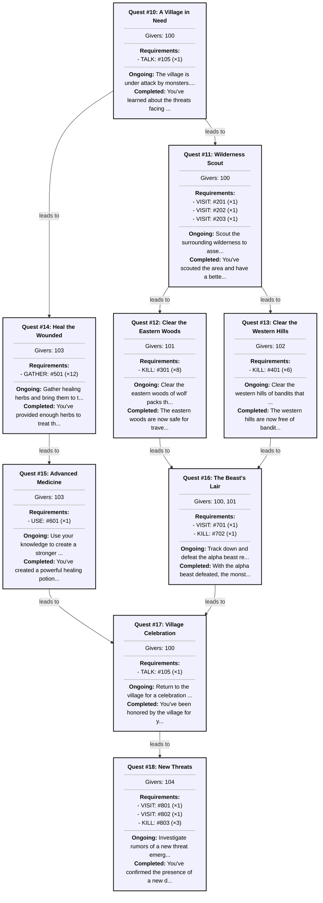

# QuestLib for Godot


A flexible, powerful quest system for Godot games, based on my original implementation of QuestLib written in Java. This library provides a complete framework for managing quests, player progression, and complex quest dependencies in your game. The repository contains a complete runnable game to test-drive the library (albeit a bit simple).
I even made an [online editor](https://rothens.github.io/QuestLib-Editor/)

## Overview

QuestLib is designed to handle all aspects of quest management in your game:

- Define quests with various objective types (kill, gather, use, visit, talk)
- Create quest chains with prerequisites and dependencies
- Track player progress across multiple quests
- Associate quests with specific NPCs or quest givers
- Save and load quest progress between sessions
- Notify the game when quests progress or complete

## Key Features

- **Flexible Quest System**: Create simple fetch quests or complex multi-stage adventures
- **Event-Driven Architecture**: Quests update based on in-game events
- **Multiple Objective Types**:
  - **KILL**: Defeat a certain number of enemies
  - **GATHER**: Collect items in the game world
  - **USE**: Use an item or interact with an object
  - **VISIT**: Travel to a specific location
  - **TALK**: Speak with an NPC
- **Quest Chains**: Quests can have prerequisites, creating meaningful progression
- **Persistent Storage**: Save quest progress to files
- **Integration Friendly**: Works with any game genre or mechanics

## Sample project's quest flow

<details>
<summary>Mermaid diagram</summary>

</details>

## Installation

1. Clone this repository or download the ZIP
2. Copy the `quest_system` folder into your Godot project
3. Ensure class names are recognized by Godot's type system

## Core Components

### QuestManager

This is the central manager that handles all quests and users. It:

- Loads quest definitions from files
- Creates and tracks QuestUser objects
- Processes quest events and notifications
- Handles progression of quests as conditions are met

### QuestDef

A quest definition template representing a specific quest type:

- Basic quest info (ID, description, ongoing and completion text)
- Requirements to complete the quest
- Prerequisites (other quests that must be done first)
- Quest giver information

### Quest

An instance of a specific quest for a player:

- Links to its definition
- Tracks progress for each requirement
- Handles updates to quest state

### QuestUser

Represents a player's quest state:

- Tracks completed quests
- Manages in-progress quests
- Holds available quests
- Processes quest notifications

### QuestSubject

Interface for anything that can be a target of a quest:

- NPCs
- Monsters
- Items
- Locations

### RequestType

Enumeration of possible quest objective types:

```gdscript
enum Type {
    KILL,
    GATHER,
    USE,
    VISIT,
    TALK
}
```

## Quest Definition Format

Quests are defined in a JSON file. Here's an example:

```json
[
  {
    "id": 1,
    "description": "Hunt the Goblins",
    "ongoing": "Kill 5 goblins in the forest to complete this quest.",
    "onfinished": "You've cleared the forest of goblins. Well done!",
    "questgivers": [10, 12],
    "prerequisites": [],
    "required": [
      {
        "id": 101,
        "type": 0,
        "count": 5
      }
    ]
  },
  {
    "id": 2,
    "description": "Goblin Champion",
    "ongoing": "Defeat the goblin champion who appeared after you cleared his minions.",
    "onfinished": "The goblin threat has been eliminated. The village is safe!",
    "questgivers": [10],
    "prerequisites": [1],
    "required": [
      {
        "id": 102,
        "type": 0,
        "count": 1
      }
    ]
  }
]
```

Where:
- `id`: Unique quest identifier
- `description`: Short title/description of the quest
- `ongoing`: Text shown while quest is active
- `onfinished`: Text shown when quest is completed
- `questgivers`: Array of NPC IDs that can give this quest
- `prerequisites`: Array of quest IDs that must be completed first
- `required`: Array of objectives
  - `id`: Subject ID (monster, item, location, etc.)
  - `type`: Objective type (0=KILL, 1=GATHER, 2=USE, 3=VISIT, 4=TALK)
  - `count`: Number of interactions required

You may also use my online QuestLibrary editor: [here](https://rothens.github.io/QuestLib-Editor/)

## Basic Usage

### 1. Setting Up

```gdscript
# Initialize quest manager
var quest_manager = QuestManager.new()
add_child(quest_manager)

# Load quest definitions
var loader = QuestJsonLoader.new("res://quests/definitions.json")
quest_manager.load_defs(loader)

# Set up storage
var storage = QuestJsonStorage.new("res://save", quest_manager)
quest_manager.load_progress(storage)

# Connect signals
quest_manager.quest_progress_updated.connect(_on_quest_progress_updated)
quest_manager.quest_finished.connect(_on_quest_finished)
quest_manager.quest_available.connect(_on_quest_available)
```

### 2. Creating Quest Subjects

Any object that can be a quest objective (monster, item, etc.) needs to implement the QuestSubject interface:

```gdscript
class Monster extends QuestSubject:
    var id: int
    var name: String
    
    func _init(p_id: int, p_name: String):
        id = p_id
        name = p_name
    
    func get_subject_id() -> int:
        return id
```

### 3. Accepting Quests

```gdscript
# Get a user by ID
var player_id = 1
var user = quest_manager.get_quest_user(player_id)

# Accept an available quest
if user.available.size() > 0:
    var quest = user.accept_quest(user.available[0])
    print("Accepted quest: " + quest.def.description)
```

### 4. Updating Quest Progress

When a player performs a quest-related action:

```gdscript
# Player kills a goblin
var goblin = Monster.new(101, "Goblin")
quest_manager.notify(player_id, goblin, RequestType.Type.KILL, 1)
```

## Quest Flow

1. **Quest Loading**: Quests are loaded from JSON definitions
2. **Starting Quests**: Quests with no prerequisites become available
3. **Quest Acceptance**: Player accepts a quest from a quest giver
4. **Quest Progress**: Game events update quest progress via notify() calls
5. **Quest Completion**: When requirements are met, quest is marked complete
6. **Unlocking**: Completion unlocks any quests that had this as a prerequisite

## Advanced Integration

### Custom Storage

The system comes with a JSON-based storage system, but you can implement your own by creating a class that follows the UDBManager interface.

### UI Integration

Connect quest events to your UI to show:
- Quest logs
- Quest trackers
- Quest completion notifications
- Available quests from NPCs

Example signal connections:

```gdscript
# Update quest log when progress changes
func _on_quest_progress_updated(user_id: int, quest_id: int):
    if user_id == player_id:
        update_quest_log()

# Show notification when quest is completed
func _on_quest_finished(user_id: int, quest_id: int):
    if user_id == player_id:
        var quest_def = quest_manager.get_def(quest_id)
        if quest_def:
            show_notification("Quest Completed: " + quest_def.description)
```

### Dialogue Integration

Connect quest state to your dialogue system:

```gdscript
# Check if NPC has a quest for player
func npc_has_available_quest(npc_id: int, player_id: int) -> bool:
    var user = quest_manager.get_quest_user(player_id)
    
    for quest_def in user.available:
        if quest_def.quest_givers.has(npc_id):
            return true
    
    return false
```

## Example: Complete Quest Cycle

1. **Define quests** in a JSON file
2. **Initialize** QuestManager and load definitions
3. **Access player state** with `quest_manager.get_quest_user(player_id)`
4. Player **talks to NPC** who has available quests
5. Player **accepts quest**
6. As player **interacts with the world**, call `quest_manager.notify()`
7. Quest system tracks progress until **completion**
8. **New quests unlock** based on what was completed
9. Player's state is **saved** for the next session

## Extending The System

You can extend the system in various ways:

- Add a **reward system** for completed quests
- Implement **timed quests** that expire
- Create **branching quests** with different outcomes
- Add **quest difficulty** ratings
- Implement **quest categories** (main story, side quests, etc.)

## Project Structure

```
quest_system/
├── quest_manager.gd     # Central manager for all quests
├── quest.gd             # Instance of a quest for a player
├── quest_def.gd         # Template/definition for quests
├── quest_request.gd     # Individual requirement in a quest
├── quest_subject.gd     # Interface for quest targets
├── quest_user.gd        # Player's quest state
├── request_type.gd      # Enum of quest types
├── json_loader.gd       # Loads quest definitions from JSON
└── json_storage.gd      # Saves/loads progress as JSON
```

## Troubleshooting

### Common Issues

- **Quests not becoming available**: Check prerequisites are being properly completed
- **Progress not saving**: Ensure your save directory exists and is writable
- **Subjects not recognized**: Make sure they implement `get_subject_id()` correctly
- **Events not triggering**: Verify signal connections and notify calls

### Debugging

Add print statements to key functions to trace quest flow:

```gdscript
# In QuestUser.notify
func notify(quest_subject: QuestSubject, req_type: int, count: int) -> void:
    print("QuestUser %d received notification for subject %d, type %d, count %d" % 
          [id, quest_subject.get_subject_id(), req_type, count])
    # ...rest of function
```

### Resetting progress

Simply delete the json file from the save folder, all quest progress will be set to the original

## License

This project is licensed under the GNU GPLv3 License - see the LICENSE file for details.
